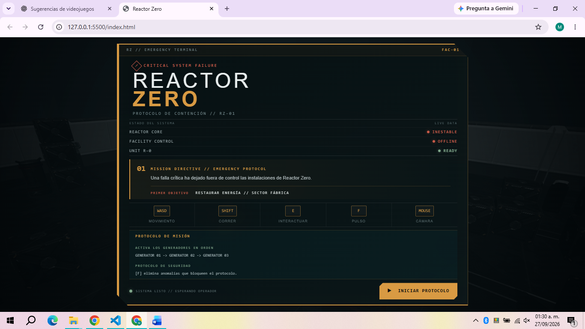
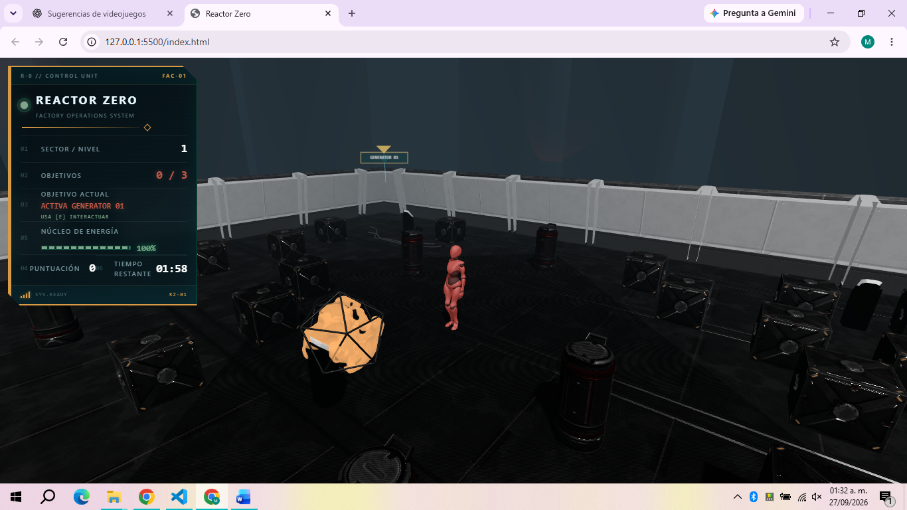
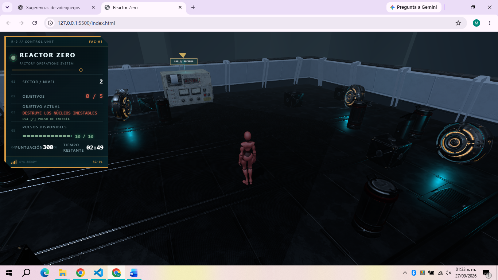
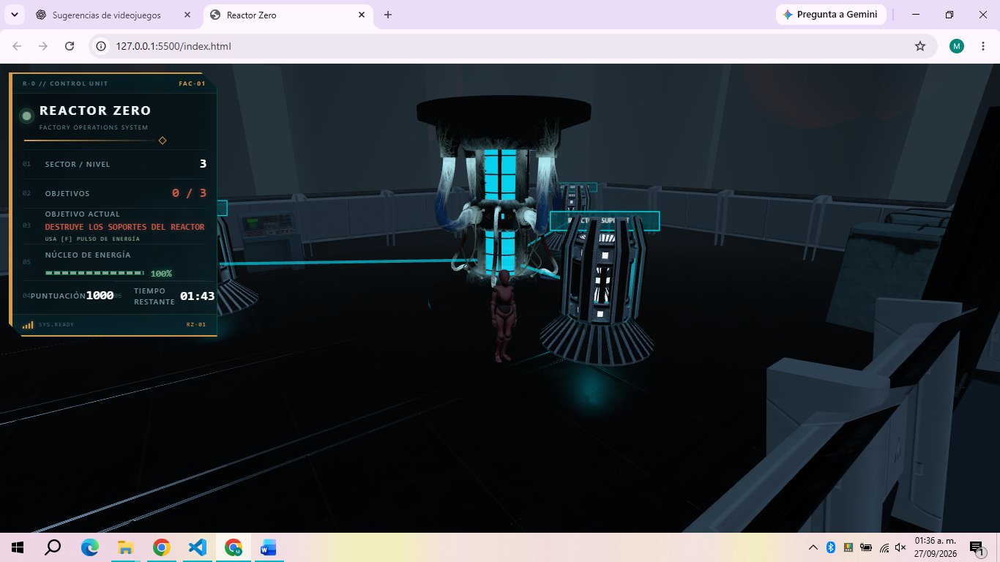
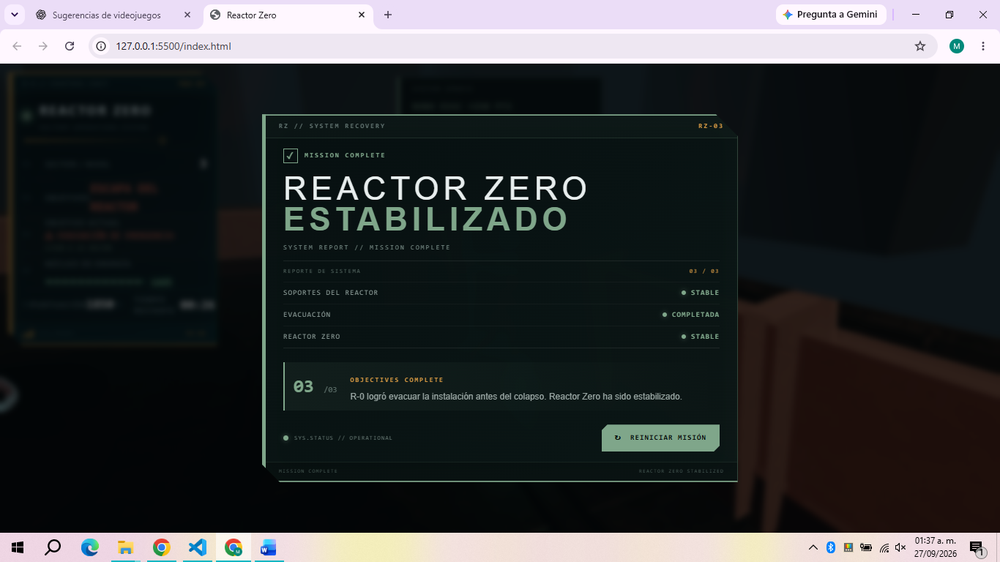

# REACTOR ZERO

**Videojuego 3D en tercera persona desarrollado con Three.js y Rapier 3D**

---

## Datos académicos

**Institución:** Tecnológico Nacional de México – Campus Pachuca  
**Carrera:** Ingeniería en Tecnologías de la Información y Comunicaciones  
**Asignatura:** Desarrollo de Soluciones en Ambientes Virtuales  
**Docente:** M.C. Víctor Manuel Pinedo Fernández  
**Actividad:** 1.6 Examen Tema 1. Introducción a las interfaces 3D y experiencia de usuario  

**Alumno(a):** Maricruz Pineda Lara 
**Matrícula:** 22200789 
**Fecha:** SEPTIEMBRE 2026

---

# 1. Descripción

**Reactor Zero** es un videojuego 3D en tercera persona ambientado en una instalación tecnológica automatizada que ha sufrido una falla crítica.

El jugador controla a la unidad robótica **R-0**, enviada al complejo con la misión de recuperar los sistemas esenciales, neutralizar fuentes de energía inestables y estabilizar el reactor central antes de que ocurra un colapso.

El videojuego está dividido en tres niveles:

1. **Fábrica**
2. **Laboratorio**
3. **Reactor Zero**

Cada nivel presenta objetivos, objetos interactivos y condiciones que deben completarse para avanzar.

El proyecto integra renderizado 3D, modelos glTF, animaciones, física, colliders, objetos dinámicos, cámara en tercera persona, interacción, ataque a distancia, HUD, puntuación, temporizadores, condiciones de victoria y derrota.

---

# 2. Historia y contexto

Una falla crítica ha dejado fuera de control las instalaciones de **Reactor Zero**.

Los sistemas principales se encuentran desconectados, diferentes fuentes de energía se han vuelto inestables y el reactor central se aproxima a un estado crítico.

La unidad autónoma **R-0** es desplegada para ingresar a las instalaciones y ejecutar un protocolo de emergencia.

Su misión consiste en:

- restaurar el suministro eléctrico de la fábrica;
- neutralizar los núcleos inestables del laboratorio;
- ingresar a Reactor Zero;
- destruir los soportes críticos del reactor;
- evacuar antes de que termine el protocolo de emergencia.

La misión termina cuando R-0 logra completar los tres niveles y alcanzar la salida de evacuación.

---

# 3. Niveles

## Nivel 1 — Fábrica

El primer sector corresponde a una instalación industrial parcialmente desactivada.

R-0 debe restaurar el suministro eléctrico activando tres generadores.

Los generadores deben activarse siguiendo el progreso establecido por la misión.

Durante el nivel aparece una anomalía energética que debe ser destruida utilizando el pulso de energía de R-0 antes de completar la restauración del sector.

### Objetivos

1. Activar **Generador 01**.
2. Activar **Generador 02**.
3. Destruir la anomalía energética.
4. Activar **Generador 03**.
5. Acceder al laboratorio.

La anomalía requiere **3 impactos** para ser destruida.

---

## Nivel 2 — Laboratorio

Después de restaurar la fábrica, R-0 accede al laboratorio.

En este sector existen **5 núcleos de energía inestables** que deben ser destruidos.

Cada núcleo requiere **3 impactos**.

El pulso de energía utiliza un recurso limitado. R-0 dispone inicialmente de:

**10 / 10 pulsos**

Cada disparo consume un pulso.

Cuando los pulsos llegan a:

**0 / 10**

R-0 ya no puede generar un nuevo proyectil de energía.

El laboratorio dispone de una **estación de recarga**, que puede utilizarse mediante la tecla `E` para recuperar:

**10 / 10 pulsos**

La recarga puede utilizarse varias veces, aunque afecta la puntuación del jugador.

### Objetivos

1. Localizar los núcleos inestables.
2. Administrar los pulsos disponibles.
3. Utilizar la estación de recarga cuando sea necesario.
4. Destruir los **5 núcleos**.
5. Acceder a Reactor Zero.

---

## Nivel 3 — Reactor Zero

El último nivel contiene el reactor central de la instalación.

El reactor está conectado a **3 soportes críticos** mediante haces de energía.

R-0 debe destruir los tres soportes utilizando su pulso.

Cada soporte tiene una integridad de:

**3 / 3**

Cada impacto reduce progresivamente su integridad:

```text
3 / 3
2 / 3
1 / 3
0 / 3
```

Cuando un soporte llega a `0 / 3`, se destruye y desaparece también su conexión energética con el reactor.

El reactor central no puede ser destruido directamente y funciona como obstáculo para los pulsos.

Cuando los tres soportes son destruidos comienza el protocolo:

**EVAC**

La iluminación cambia a estado de emergencia y R-0 dispone de **30 segundos** para llegar a la salida.

Durante EVAC aparece un modelo 3D **EXIT** integrado en la zona de evacuación. Este modelo funciona como referencia visual de la salida, pero la condición real de victoria continúa dependiendo de que R-0 alcance la zona de evacuación.

---

# 4. Reglas del juego

Las principales reglas son:

- R-0 debe completar los objetivos de cada nivel para avanzar.
- Los objetivos se muestran mediante el HUD y marcadores visuales dentro del escenario.
- Los objetos sólidos relevantes poseen colliders.
- R-0 no puede atravesar paredes, maquinaria ni obstáculos configurados como sólidos.
- Los objetos dinámicos pueden reaccionar físicamente a las interacciones.
- Los pulsos de energía pueden impactar objetos y objetivos.
- Los objetivos destructibles requieren varios impactos.
- En el Nivel 2 existe una cantidad limitada de pulsos.
- La estación del laboratorio permite recuperar los pulsos.
- Las recargas generan una penalización progresiva de puntuación.
- Cada nivel posee un tiempo límite.
- Durante EVAC existe un temporizador especial de 30 segundos.
- Al finalizar una partida se presenta un estado de victoria o derrota.

---

## Sistema de pausa

Durante una partida activa el HUD muestra un botón **PAUSA**. Al utilizarlo aparece la pantalla **JUEGO EN PAUSA**, desde la cual se puede continuar la partida.

Mientras el juego está pausado se bloquean las acciones del jugador, se congelan los temporizadores y se detienen las actualizaciones relevantes del gameplay. La música y los sonidos que corresponda se pausan y posteriormente continúan desde su posición.

El sistema respeta estados especiales como recarga, EVAC, victoria y derrota.

---

# 5. Condiciones de victoria y derrota

## Victoria

Para ganar el videojuego se deben completar los tres niveles.

La secuencia general es:

```text
NIVEL 1
FÁBRICA
↓
Restaurar generadores
↓
Destruir anomalía
↓
NIVEL 2
LABORATORIO
↓
Destruir 5 núcleos
↓
NIVEL 3
REACTOR ZERO
↓
Destruir 3 soportes
↓
EVAC
↓
Llegar a la salida
↓
VICTORIA
```

La pantalla final muestra:

**REACTOR ZERO ESTABILIZADO**

En la victoria final del videojuego también se presenta el crédito:

```text
AUTOR
MARICRUZ PINEDA LARA
```

---

## Derrota

La partida puede terminar en derrota cuando se agota el tiempo disponible para completar una misión.

En el Nivel 3 existe además una condición especial.

Después de destruir los tres soportes comienza un contador de:

**30 segundos**

Si R-0 no alcanza la salida antes de que el contador llegue a `00:00`, la evacuación falla y se activa el estado de derrota.

Durante los estados finales se detienen o restringen las acciones del jugador y se proporciona una opción para iniciar nuevamente la partida.

---

# 6. Controles

| Control | Acción |
|---|---|
| `W` | Avanzar |
| `A` | Movimiento a la izquierda |
| `S` | Retroceder |
| `D` | Movimiento a la derecha |
| `SHIFT` | Correr |
| `E` | Interactuar / activar / recargar |
| `F` | Lanzar pulso de energía |
| `Mouse` | Controlar la cámara |
| `Rueda del mouse` | Acercar o alejar la cámara |

---

# 7. Personaje y animaciones

El personaje principal es la unidad robótica **R-0**.

El sistema utiliza `THREE.AnimationMixer` para controlar las animaciones del personaje.

Entre los estados utilizados se encuentran:

- **Idle** — personaje detenido.
- **Walk** — desplazamiento normal.
- **Run** — desplazamiento utilizando `SHIFT`.
- **Attack** — acción utilizada al lanzar el pulso de energía.

Las animaciones cambian dependiendo de las acciones realizadas por el jugador.

---

# 8. Mecánica principal

La mecánica principal consiste en un **pulso de energía a distancia** activado mediante la tecla:

`F`

Al realizar un ataque:

1. R-0 ejecuta su animación de ataque.
2. Se genera un pulso de energía.
3. El pulso avanza en la dirección del ataque.
4. Se utiliza detección de impactos para identificar el primer objetivo válido.
5. Dependiendo del objeto impactado se aplica la reacción correspondiente.

El sistema puede interactuar con:

- anomalías;
- núcleos inestables;
- soportes del reactor;
- objetos físicos;
- obstáculos;
- reactor central.

Los elementos visuales como etiquetas y marcadores no participan en la detección física de los pulsos.

---

# 9. Sistema de energía y pulsos

Durante el Nivel 2, la energía de R-0 se representa mediante la cantidad de pulsos disponibles.

El HUD muestra:

```text
PULSOS DISPONIBLES
10 / 10
```

Cada pulso consume una cantidad fija de energía.

Por ejemplo:

```text
10 / 10
9 / 10
8 / 10
...
1 / 10
0 / 10
```

Cuando no existen pulsos disponibles, la animación de ataque puede ejecutarse, pero no se genera un proyectil capaz de producir daño.

El jugador debe localizar la estación de recarga y utilizar `E` para recuperar los pulsos.

---

# 10. Sistema de puntuación

El videojuego utiliza un sistema de puntuación acumulativo durante los tres niveles.

La puntuación recompensa el cumplimiento de los objetivos y la eficiencia del jugador.

| Acción | Puntos |
|---|---:|
| Activar un generador | +100 |
| Destruir un núcleo inestable | +150 |
| Destruir un soporte del reactor | +200 |
| Evacuación | +10 por cada segundo restante |

## Bono de evacuación

Al completar correctamente EVAC se otorga un bono dependiendo del tiempo restante.

La fórmula utilizada es:

```text
Bono = segundos restantes × 10
```

Ejemplo:

```text
17 segundos restantes × 10 = +170 puntos
```

---

## Penalización por recarga

Durante el Nivel 2, utilizar la estación de recarga genera una penalización progresiva.

| Número de recarga | Penalización |
|---|---:|
| Primera recarga | -50 |
| Segunda recarga | -100 |
| Tercera recarga | -150 |
| Cuarta recarga | -200 |
| Siguientes | +50 de penalización por cada recarga |

La fórmula utilizada es:

```text
Penalización = número de recarga × 50
```

La puntuación nunca puede ser inferior a `0`.

Esto permite que la estación siga funcionando como mecanismo de recuperación sin impedir que el jugador continúe la misión.

---

# 11. HUD e interfaz

El videojuego utiliza un HUD para presentar información relevante durante la partida.

Entre los datos mostrados se encuentran:

- nivel actual;
- objetivo;
- progreso de la misión;
- energía o pulsos disponibles;
- puntuación;
- tiempo restante;
- notificaciones;
- estado de los objetivos.

Los objetivos también utilizan marcadores 3D de estilo holográfico para facilitar su localización.

Los marcadores utilizan elementos como:

- beacon vertical;
- diamante holográfico;
- chevron flotante;
- efectos emisivos.

En Reactor Zero también aparecen leyendas asociadas a los soportes del reactor.

---

# 12. Cámara en tercera persona

El videojuego utiliza una cámara en tercera persona controlada mediante `OrbitControls`.

El jugador puede:

- girar alrededor de R-0;
- modificar el ángulo de visión;
- acercar la cámara;
- alejar la cámara.

También se implementó un sistema de **camera collision**.

El sistema realiza comprobaciones entre el objetivo de la cámara y su posición deseada.

Cuando una pared u obstáculo estructural se encuentra entre R-0 y la cámara, esta se reposiciona para permanecer dentro del escenario.

Cuando el obstáculo deja de interferir, la cámara recupera progresivamente una distancia de visualización adecuada.

Durante el desplazamiento, la cámara puede recuperar progresivamente una posición posterior respecto a R-0 utilizando la orientación actual del personaje como referencia. La intervención manual del jugador con el mouse tiene prioridad temporalmente; después de esa interacción, la cámara puede volver de forma suave a su posición de seguimiento.

La detección de obstáculos continúa teniendo prioridad sobre el seguimiento para evitar que la cámara atraviese paredes o estructuras.

Esto evita que el jugador observe accidentalmente el exterior de las instalaciones al colocar la cámara detrás de una pared.

---

# 13. Sistema de física

El sistema de física utiliza **Rapier 3D**.

Rapier administra cuerpos rígidos y colliders que representan las superficies físicas del escenario. Los colliders son las formas utilizadas para generar contactos y detectar colisiones.

El proyecto utiliza diferentes tipos de cuerpos dependiendo de su función.

### Elementos estáticos

Se utilizan cuerpos fijos y colliders para elementos como:

- suelo;
- paredes;
- reactor;
- soportes;
- computadoras;
- maquinaria;
- paneles de control;
- obstáculos del escenario.

### Objetos dinámicos

Algunos objetos utilizan cuerpos dinámicos y pueden reaccionar ante fuerzas o impulsos.

Entre ellos se encuentran objetos como:

- cajas;
- barriles;
- props físicos.

### Personaje

R-0 utiliza representación física para evitar atravesar las superficies relevantes del escenario.

La implementación combina el movimiento del personaje con comprobaciones físicas para mantenerlo dentro de las zonas jugables.

---

# 14. Objetos interactivos

El videojuego contiene diferentes tipos de objetos 3D con funciones distintas.

Entre ellos se encuentran:

- generadores;
- anomalía energética;
- núcleos inestables;
- soportes del reactor;
- cajas;
- barriles;
- computadoras;
- maquinaria;
- paneles de control;
- estación de recarga;
- reactor central;
- salida de evacuación.

Algunos objetos son interactivos mediante `E`, otros responden al pulso de energía y otros funcionan como obstáculos físicos.

---

# 15. Tecnologías utilizadas

| Tecnología | Uso |
|---|---|
| HTML5 | Estructura de la aplicación |
| CSS3 | Diseño de interfaz, HUD y pantallas |
| JavaScript ES6+ | Lógica general del videojuego |
| Three.js | Renderizado y administración de la escena 3D |
| GLTFLoader | Carga de modelos glTF |
| OrbitControls | Cámara controlada mediante mouse |
| AnimationMixer | Animaciones de R-0 |
| Rapier 3D | Física, rigid bodies y colliders |
| Bootstrap | Elementos auxiliares de interfaz |
| glTF / GLB | Formato de modelos 3D |
| Git | Control de versiones |
| GitHub | Repositorio del proyecto |
| Visual Studio Code | Entorno de desarrollo |
| Live Server | Ejecución y pruebas locales |

---

# 16. Estructura general del proyecto

La estructura general del proyecto es:

```text
reactor-zero/
|
|-- index.html
|-- README.md
|
|-- assets/
|   |
|   |-- favicon/
|   |
|   |-- css/
|   |   |-- styles.css
|   |
|   |-- js/
|   |   |-- main.js
|   |   |-- game.js
|   |   |-- player.js
|   |   |-- physics.js
|   |   |-- levels.js
|   |   |-- ui.js
|   |
|   |-- sounds/
|   |   |-- music/
|   |   |-- sfx/
|   |
|   |-- models/
|       |
|       |-- character/
|       |-- environment/
|       |   |-- level1/
|       |   |-- level3/
|       |-- props/
|       |-- decoration/
|       |-- anomaly/
|       |-- cores/
|       |-- lab/
|       |-- reactor/
|       |-- soporte/
|       |-- control-panel/
|       |-- spind/
|
|-- docs/
    |-- screenshots/
```

La mayor parte de la lógica funcional se encuentra actualmente en `assets/js/main.js`.

Los archivos auxiliares permiten mantener una estructura preparada para una separación posterior de responsabilidades.

---

# 17. Recursos externos y créditos

Los modelos y recursos externos utilizados en **Reactor Zero** pertenecen
a sus respectivos autores y se utilizan respetando las licencias indicadas
por sus fuentes originales.

Las texturas incluidas dentro de los modelos forman parte de los recursos
originales correspondientes.

---

## Sci-Fi Essentials Kit — Environment y Decoration

Los elementos utilizados para construir y decorar las instalaciones,
incluyendo paredes, estructuras, computadoras, cables, ventilación,
cajas, barriles y otros elementos industriales, provienen del
Sci-Fi Essentials Kit.

**Autor:** Quaternius  
**Fuente:** Quaternius  
**URL:** https://quaternius.com  
**Licencia:** CC0 1.0 Universal (CC0 1.0) — Public Domain Dedication  
**Licencia URL:** https://creativecommons.org/publicdomain/zero/1.0/

Carpetas principales utilizadas:

- `assets/models/environment/`
- `assets/models/decoration/`

---

## Personaje R-0 — Mixamo

El personaje principal R-0 utiliza como base el personaje X Bot y
animaciones obtenidas mediante Adobe Mixamo.

Animaciones utilizadas:

- Idle
- Walk
- Run
- Attack

**Plataforma:** Adobe Mixamo  
**Recurso:** X Bot / animaciones Mixamo  
**URL:** https://www.mixamo.com/

Los recursos de Mixamo se utilizan de acuerdo con los términos de uso
aplicables de Adobe.

---

## Sci-Fi Energy Orb — Anomalía

Modelo utilizado para representar la anomalía energética del Nivel 1.

**Nombre:** Sci-Fi Energy Orb  
**Autor:** Bim44  
**Fuente:** Sketchfab  
**Modelo:** https://sketchfab.com/3d-models/sci-fi-energy-orb-eaaf2a000a5a4b8a9219a1de1c900e61  
**Autor:** https://sketchfab.com/Bim44  
**Licencia:** Creative Commons Attribution 4.0 (CC BY 4.0)  
**Licencia URL:** http://creativecommons.org/licenses/by/4.0/

---

## Sci Fi Energy Core 1 — Núcleos del laboratorio

Modelo utilizado para representar los cinco núcleos de energía
inestables del Nivel 2.

**Nombre:** Sci Fi Energy Core 1  
**Autor:** FilipZelinka  
**Fuente:** Sketchfab  
**Modelo:** https://sketchfab.com/3d-models/sci-fi-energy-core-1-a5aefe7b281f46529aed2ec9d873bc52  
**Autor:** https://sketchfab.com/FilipZelinka  
**Licencia:** Creative Commons Attribution 4.0 (CC BY 4.0)  
**Licencia URL:** http://creativecommons.org/licenses/by/4.0/

---

## Parapsychology PSI Event Generator — Laboratorio

Modelo utilizado como parte del equipamiento científico del laboratorio.

**Nombre:** Parapsychology PSI Event Generator  
**Autor:** ULT7R4  
**Fuente:** Sketchfab  
**Modelo:** https://sketchfab.com/3d-models/parapsychology-psi-event-generator-d40b69daaf8445a58cd02455058bf277  
**Autor:** https://sketchfab.com/ULT7R4  
**Licencia:** Creative Commons Attribution 4.0 (CC BY 4.0)  
**Licencia URL:** http://creativecommons.org/licenses/by/4.0/

---

## GD52_MOD1_A2_SaigeBaker — Reactor central

Modelo utilizado para representar el reactor central del Nivel 3.

**Nombre:** GD52_MOD1_A2_SaigeBaker  
**Autor:** TheArtGun  
**Fuente:** Sketchfab  
**Modelo:** https://sketchfab.com/3d-models/gd52-mod1-a2-saigebaker-05270793c636474883a3d8ceaedb3cf3  
**Autor:** https://sketchfab.com/theartgun  
**Licencia:** Creative Commons Attribution 4.0 (CC BY 4.0)  
**Licencia URL:** http://creativecommons.org/licenses/by/4.0/

---

## Large Shield Generator — Soportes del reactor

Modelo utilizado para representar los tres soportes críticos conectados
al reactor central.

**Nombre:** Large Shield Generator  
**Autor:** MRowa  
**Fuente:** Sketchfab  
**Modelo:** https://sketchfab.com/3d-models/large-shield-generator-c04645011b834e3bb85842f395213abc  
**Autor:** https://sketchfab.com/MRowa  
**Licencia:** Creative Commons Attribution-ShareAlike 4.0 (CC BY-SA 4.0)  
**Licencia URL:** http://creativecommons.org/licenses/by-sa/4.0/

La licencia requiere atribución al autor y que las versiones modificadas
se mantengan bajo la misma licencia.

---

## Old Control Panel — Panel de control

Modelo utilizado como panel industrial dentro del Nivel 3.

**Nombre:** Old Control Panel  
**Autor:** mikelkel2  
**Fuente:** Sketchfab  
**Modelo:** https://sketchfab.com/3d-models/old-control-panel-b84686130a2442d985c6f36c23d0836d  
**Autor:** https://sketchfab.com/mikelkel2  
**Licencia:** Creative Commons Attribution 4.0 (CC BY 4.0)  
**Licencia URL:** http://creativecommons.org/licenses/by/4.0/

---

## Spinds — Maquinaria industrial

Modelo utilizado como maquinaria industrial y elemento de ambientación
del Nivel 3.

**Nombre:** Spinds  
**Autor:** hoschu  
**Fuente:** Sketchfab  
**Modelo:** https://sketchfab.com/3d-models/spinds-83e88175a01c492d9fbc2639c75138a8  
**Autor:** https://sketchfab.com/hoschu  
**Licencia:** Creative Commons Attribution-NonCommercial 4.0
(CC BY-NC 4.0)  
**Licencia URL:** http://creativecommons.org/licenses/by-nc/4.0/

Este modelo requiere atribución al autor y no permite uso comercial.

---

## Texturas

Las texturas utilizadas por los modelos glTF forman parte de los
respectivos recursos descargados y se encuentran sujetas a la licencia
del modelo al que pertenecen.

No se atribuyen de manera independiente cuando forman parte del mismo
recurso original.

---

## Sonidos y música

El videojuego utiliza música ambiental por nivel y efectos de sonido asociados a eventos del gameplay.

Archivos de música:

- `assets/sounds/music/level1_factory.mp3`
- `assets/sounds/music/level2_lab.mp3`
- `assets/sounds/music/level3_reactor.mp3`

Efectos de sonido:

- `assets/sounds/sfx/energy_impact.mp3`
- `assets/sounds/sfx/energy_pulse.mp3`
- `assets/sounds/sfx/energy_recharge.mp3`
- `assets/sounds/sfx/evacuation_alarm.mp3`
- `assets/sounds/sfx/generator_activate.mp3`
- `assets/sounds/sfx/objective_destroyed.mp3`
- `assets/sounds/sfx/victory.mp3`
- `assets/sounds/sfx/lost-energy.mp3`
- `assets/sounds/sfx/game-over.mp3`
- `assets/sounds/sfx/buttom.mp3`

Cada nivel posee música ambiental. Los efectos se reproducen según eventos del juego, incluyendo ataque, impacto, activación, recarga, objetivos, pérdida de energía, derrota, victoria y botones.

La fase EVAC utiliza una alarma de emergencia. El sistema de audio está integrado con la pausa para detener y continuar los sonidos cuando corresponde.

Recursos con origen documentado en Pixabay:

- Level 1 Factory: https://pixabay.com/music/epic-classical-blade-runnervangelis-lead-epic-synth-theme-dark-waves-pt-2-446512/
- Level 2 Laboratory: https://pixabay.com/music/low-drones-sci-fi-ambient-347390/
- Level 3 Reactor: https://pixabay.com/music/build-up-scenes-the-origin-289077/
- Energy Pulse: https://pixabay.com/sound-effects/film-special-effects-high-voltage-spark-486895/
- Energy Impact: https://pixabay.com/sound-effects/film-special-effects-ground-impact-352053/
- Generator Activate: https://pixabay.com/sound-effects/film-special-effects-level-up-2-540176/
- Energy Recharge: https://pixabay.com/sound-effects/film-special-effects-energy-drink-effect-230559/
- Objective Destroyed: https://pixabay.com/sound-effects/film-special-effects-cinematic-electricity-explosive-stinger-energy-burst-1-228344/
- Evacuation Alarm: https://pixabay.com/sound-effects/film-special-effects-sci-fi-alarm-95054/
- Victory: https://pixabay.com/sound-effects/film-special-effects-achievement-badge-pop-sound-2-547865/

Para `lost-energy.mp3`, `game-over.mp3` y `buttom.mp3`, la referencia de origen queda pendiente de documentar si es necesario.

---

# 18. Uso de Inteligencia Artificial

Durante el desarrollo de **Reactor Zero** se utilizaron herramientas de Inteligencia Artificial como apoyo para programación, análisis de errores, revisión de lógica y propuestas de implementación.

Las principales herramientas utilizadas fueron:

- ChatGPT
- OpenAI Codex integrado en Visual Studio Code

La IA se utilizó como **asistente de desarrollo**, no como sustituto del proceso de implementación y validación.

Las sugerencias y modificaciones fueron revisadas y probadas manualmente antes de incorporarlas a versiones estables mediante Git.

Entre los aspectos trabajados con asistencia de IA se encuentran:

- integración y revisión del sistema de física;
- creación y ajuste de colliders;
- sistema de pulsos de energía;
- detección de impactos mediante raycasting;
- lógica de objetivos;
- HUD;
- puntuación;
- sistema de recarga;
- transiciones entre niveles;
- cámara en tercera persona;
- camera collision;
- recuperación progresiva de cámara detrás de R-0;
- sistema de pausa;
- sistema de audio;
- limpieza de objetos entre niveles;
- marcadores visuales;
- sistema de evacuación;
- identificación y depuración de errores.

---

# 19. Correcciones realizadas durante el desarrollo

Las soluciones propuestas durante el desarrollo fueron sometidas a pruebas manuales.

Entre las principales correcciones realizadas se encuentran:

### Colliders

Se ajustaron colliders de paredes, computadoras, reactor, soportes, panel de control y maquinaria para evitar que R-0 atravesara objetos sólidos.

### Objetos GLTF compartidos

Se detectó que algunos clones glTF compartían geometrías y materiales.

Eliminar o liberar incorrectamente estos recursos provocaba que otros modelos desaparecieran.

Se modificó el sistema de limpieza para eliminar las instancias correspondientes sin destruir recursos compartidos utilizados por otros clones.

### Texturas

Se corrigieron rutas y organización de texturas de modelos glTF para que fueran cargadas correctamente.

### Cámara

Inicialmente la cámara podía atravesar las paredes y mostrar el exterior de la instalación.

Se implementó un sistema de detección que reposiciona la cámara cuando existe una estructura entre el jugador y la posición deseada.

También se integró una recuperación progresiva de la posición posterior de la cámara durante el movimiento de R-0, respetando la intervención manual del jugador y la prioridad de la oclusión.

### Raycast y etiquetas

Después de incorporar etiquetas mediante `THREE.Sprite` a los soportes del Nivel 3, el raycast de los pulsos intentaba procesar también estos elementos visuales.

Esto producía un error relacionado con `Raycaster.camera`.

Se corrigió el sistema para que los elementos visuales como sprites y labels no participen en la detección de impactos de los proyectiles.

### Nivel 2

Se implementó y verificó:

- límite de pulsos;
- HUD de pulsos disponibles;
- estación de recarga;
- penalización progresiva;
- colliders de computadoras;
- objetivos y marcadores.

### Nivel 3

Se implementó y verificó:

- reactor central;
- tres soportes destructibles;
- integridad de 3 impactos;
- haces de energía;
- colliders;
- etiquetas;
- iluminación de emergencia;
- zona EVAC;
- salida 3D EXIT como referencia visual de evacuación;
- contador de 30 segundos;
- victoria;
- derrota.

Cada modificación importante fue probada antes de crear un nuevo punto estable en el historial de Git.

---

# 20. Pruebas realizadas

Se realizaron pruebas funcionales individuales y recorridos completos del videojuego.

Entre las pruebas se incluyen:

- carga de modelos;
- carga de texturas;
- movimiento del personaje;
- Idle;
- Walk;
- Run;
- Attack;
- cámara;
- zoom;
- camera collision;
- oclusión de cámara;
- recuperación progresiva de la cámara detrás de R-0;
- colliders;
- objetos dinámicos;
- generadores;
- anomalía;
- núcleos;
- pulsos disponibles;
- estación de recarga;
- puntuación;
- soportes del reactor;
- raycast;
- temporizadores;
- pausa y continuación;
- pausa y reanudación de audio;
- música de los tres niveles;
- efectos de sonido;
- EVAC;
- alarma EVAC;
- salida 3D EXIT del Nivel 3;
- victoria;
- pantalla final y crédito del autor;
- derrota;
- reinicio;
- transiciones entre niveles.

También se realizó una partida completa:

```text
INICIO
↓
NIVEL 1 — FÁBRICA
↓
NIVEL 2 — LABORATORIO
↓
NIVEL 3 — REACTOR ZERO
↓
EVAC
↓
VICTORIA
```

---

# 21. Ejecución local

Debido al uso de módulos JavaScript y carga de recursos externos, el proyecto debe ejecutarse mediante un servidor local.

## Opción recomendada — Visual Studio Code + Live Server

1. Descargar o clonar el repositorio.
2. Abrir la carpeta del proyecto en Visual Studio Code.
3. Instalar la extensión **Live Server**, si no está instalada.
4. Abrir `index.html`.
5. Presionar clic derecho.
6. Seleccionar:

```text
Open with Live Server
```

El navegador abrirá una dirección similar a:

```text
http://127.0.0.1:5500/index.html
```

7. Esperar a que los modelos y recursos terminen de cargar.
8. Presionar:

```text
INICIAR PROTOCOLO
```

---

# 22. Capturas representativas

Las capturas se almacenan en:

```text
docs/screenshots/
```

## Pantalla de inicio



## Nivel 1 — Fábrica



## Nivel 2 — Laboratorio



## Nivel 3 — Reactor Zero



## Victoria



---

# 23. Git y control de versiones

El proyecto utiliza **Git** como sistema de control de versiones.

Durante el desarrollo se generaron diferentes commits correspondientes a etapas funcionales del videojuego.

El objetivo fue conservar un historial progresivo en lugar de desarrollar todo el proyecto y realizar un único commit al finalizar.

Las versiones representan avances como:

- estructura inicial;
- escenario;
- personaje;
- animaciones;
- física;
- objetos;
- mecánicas;
- Nivel 1;
- Nivel 2;
- Nivel 3;
- HUD;
- puntuación;
- correcciones;
- mejoras visuales;
- versión final.

---

# 24. GitHub Pages

La versión final del videojuego será publicada mediante **GitHub Pages**.

**Repositorio:**

```text
https://github.com/MaricruzPil/reactor-zero
```

**Videojuego publicado:**

```text
https://maricruzpil.github.io/reactor-zero/
```


# 25. Estado del proyecto

**Estado actual: versión funcional completa.**

Los tres niveles pueden jugarse de forma consecutiva desde el inicio hasta la pantalla de victoria.

Los sistemas finales de cámara, audio, pausa y evacuación fueron integrados y probados.
